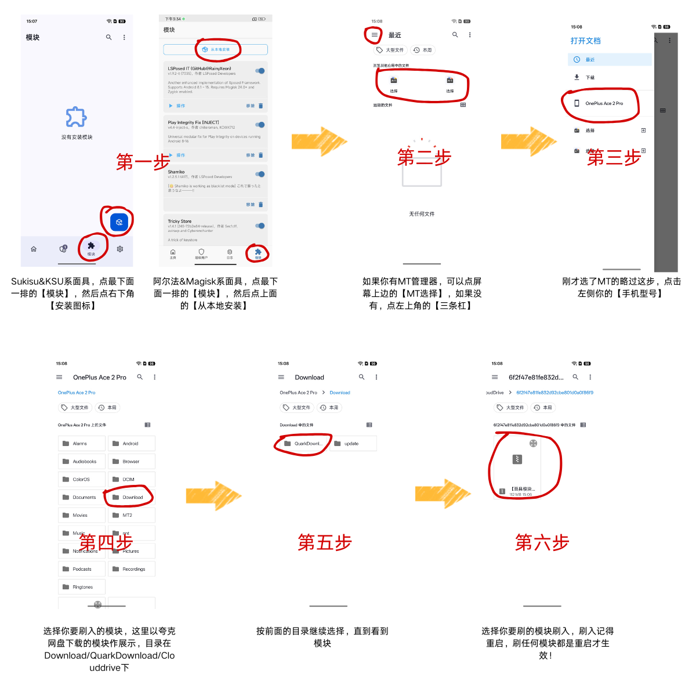
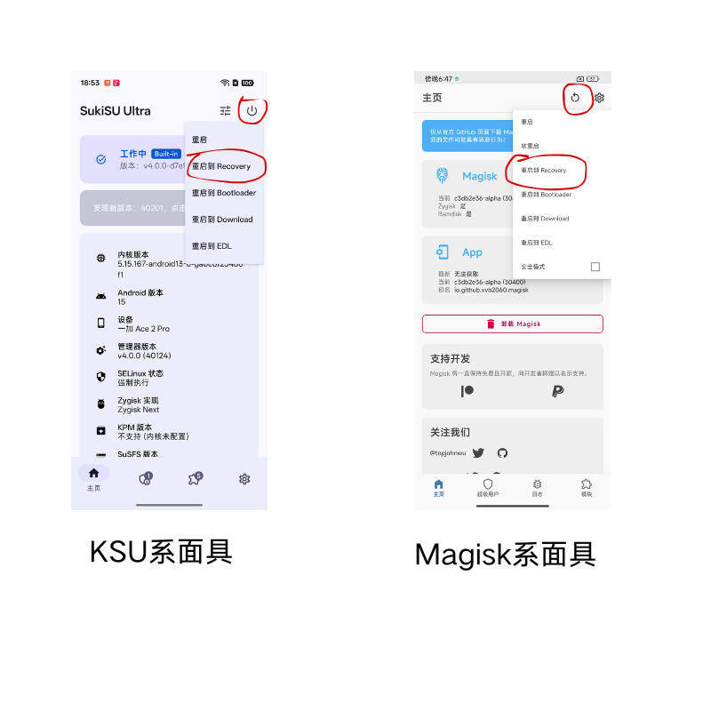
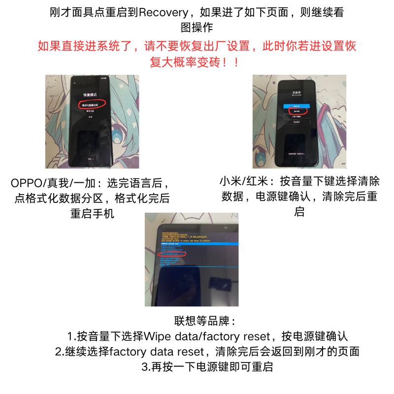
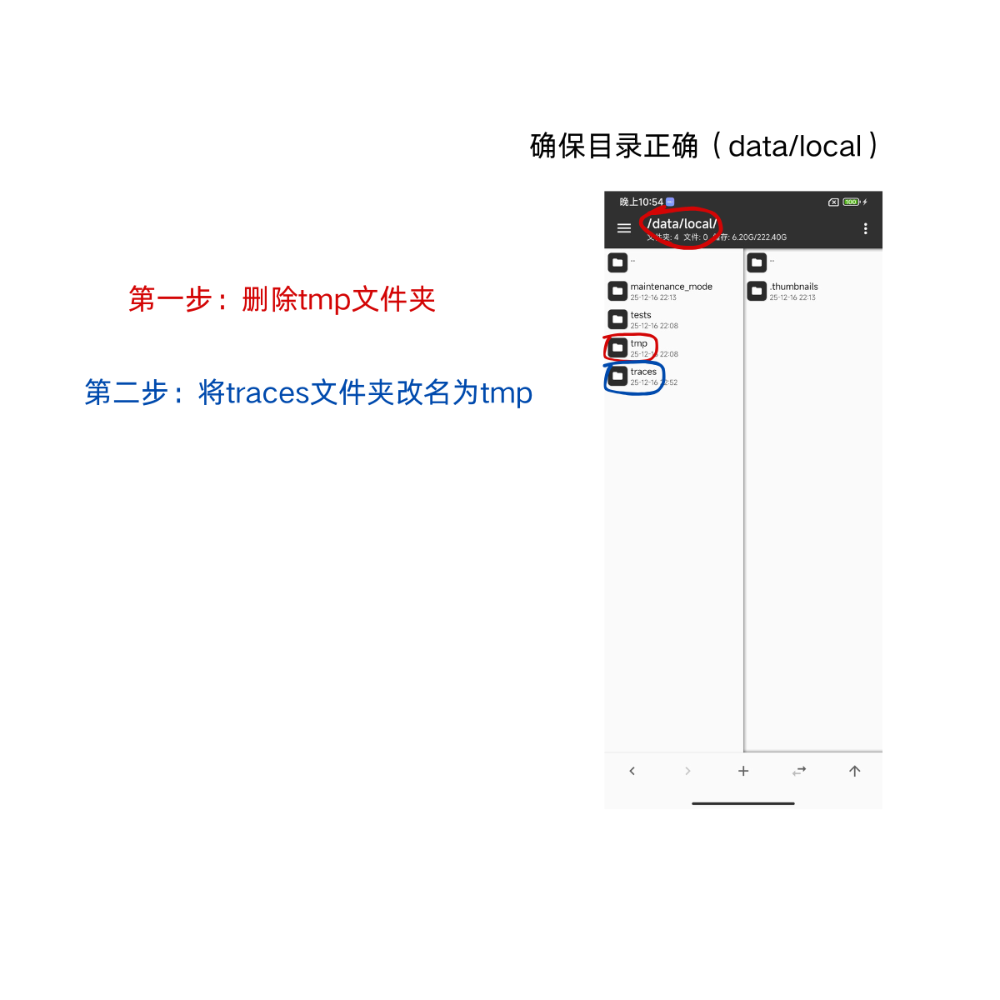

# 阿花数码玩机手册

> ## 前言
>
> 本站主要提供Root后出现各种问题的解决方案，不是Root刷机解锁教程！
>

**购买Root机、解锁刷机Root、救砖、维修、过环境等可联系作者阿花数码 QQ/VX同号：6934489**

**持续更新中，如果你有手册中没有收录到的问题也可以联系我补充**

**点击左下角的三条杠可以打开目录！！**

**点击左下角的三条杠可以打开目录！！**

**点击左下角的三条杠可以打开目录！！**

本站提供的文件下载链接：[点此下载](https://pan.quark.cn/s/b4f00dec1bca)  (夸克App)
或保存二维码使用夸克App扫码 

# 新手入门指南
---
## 如何刷模块

**任何网盘，只要是压缩包或者.zip结尾的文件，都不要点进去，不要解压，直接保存文件下载即可！！**

先下载好模块，以夸克网盘为例，下载后的文件在Download/QuarkDownload/Clouddrive目录下

然后按图打开面具=》模块=》刷入图标，选择已下载的文件，安装，**安装完后重启**

详细操作看下图

---

## 如何恢复出厂设置

**话先说在前面，恢复出厂设置有小概率机器会砖（主要是GKI的问题），请做好变砖的心理准备，变砖了可以找我远程或者邮寄刷好**

我这里推荐一个相对安全一些的方法，不要进系统设置恢复

首先看下图，进面具重启到Recovery

---

## 如何使用一键包过环境

### 1.准备工作

强烈建议恢复出厂设置后使用，可达到最佳效果，目前测试绝大部分机型都可完美过环境。若实在不行，去MT删除data/adb内所有文件重启后再刷入一键包（注：此操作会删除所有现有模块和面具设置）

[点击查看如何恢复出厂设置](#如何恢复出厂设置)

点击查看如何在MT中删除data/adb

### 2.刷入模块

在网盘2号文件中下载一键包（注意看文件名，对应你的面具和系统版本下载），下载完后刷入并重启。

[点击查看如何刷模块](#如何刷模块)

### 3.执行模块

点击查看操作步骤

 

阿尔法&Magisk系面具有额外步骤，点击查看

---

## 如何打开“USB调试“或“开发者模式”

开发者模式：一般在设置-关于本机里，找到”版本信息“或”系统版本“，连续点进此项后，底部会提示开发者模式已启用

USB调试：启用开发者后，在设置里搜索"usb调试"即可，小米的机器需要额外打开"usb调试（安全设置）"，打开时需要插卡联网登录账号

# 游戏科技相关问题

>>## 前言（必看）

如果你是刚入坑的萌新，请做好被封的心理准备，也不要一开始就拿大号高价值账号尝试，**只要长期开科技的，几乎就没有不被封过号的**，哪怕是所谓白名单大主播也有被封的时候，我们要做的是减少被封的概率，而不是100%的防封。

**所有号称100%防封的环境都是骗子！！！**

**所有号称100%防封的科技都是骗子！！！**

**所有号称100%防封的端口都是骗子！！！**

**所有号称100%防封的机器都是骗子！！！**

---
>## 游戏上号器/金融软件提示Root

首先，**一定不要给这些软件授权Root！**

**一定不要给这些软件授权Root！**

**一定不要给这些软件授权Root！**

如果你是阿尔法/magisk系的面具，还需要：
- 隐藏magisk应用
- 安装shamiko模块并配置黑白名单

详见阿尔法过环境教程，这里不作多解释（Sukisu等KSU系无视）

另外，有部分App可能会检测应用列表，**不要给这个App获取应用列表权限，或者用隐藏应用列表App对其启用并配置好**

>## 设备黑了怎么办&&如何确定设备是否黑了

先简单说一下什么是设备黑了，如果游戏厂商确定你开科技了，除了会封你的号外，还会标记你的设备，导致你的设备后面无论切换什么账号，都会出现异常

但很多人其实不是设备黑，是自身环境有问题（如误给了游戏root，被游戏检测到了违规app等），这种情况只要把环境做好就行

所以，如果你不确定是不是环境有问题的话：

>1.先确保现在的**环境检测软件全部正常**，不正常的可以查看手册对应修复
>
>2.确保不要给游戏Root授权，lsp框架不要把游戏作为启用对象（不确定就直接关了lsp模块）
>
>3.删除所有美化、画质助手等游戏相关App
>
>**4.游戏删除并重新下载，或者长按游戏app=》应用详情=》清除数据（这步很重要）**
>
>**5.更换一个正常的账号（不要用数据号来测试是否黑设备）**
>
>**6.测试时不要开科技**

以上搞完重新进游戏，如果账号还是异常，说明设备是真的黑了，在网盘8号文件夹中有对应的清理脚本，但不一定有用，**100%有用的方法是恢复出厂设置，**恢复出厂前，建议把Root管理器备份一下，可以直接qq传个人，或者上传到网盘，如果实在没备份，至少记一下版本号，然后恢复完去网盘下载

[点击查看如何恢复出厂设置](#如何恢复出厂设置)

# Root常见问题

---

>## 所有检测软件一定要过吗？

**先说结论：并不是**

Root检测软件就像是平常的模拟考试，考试的范围已经明牌给你划出来了，但是游戏/金融类App的游戏是一场闭卷考试，他不会告诉你他考了什么，他只会直接给你结果：过了（正常使用） 或者没过（打不开/封号了）。

举个例子：检测软件告诉你，要考语文数学，然后你针对性的配置了一下，过了。
但是游戏不告诉你要考什么，他在你不知情的情况下，偷偷的考了英语，然后发现你英语不行，结果就是告诉你没过（封号/强退了），在你的视角里，你还是不知道游戏考了什么，只知道有东西没过

某大厂目前已公开的游戏检测项目有：
- 虚拟机
- 模拟器
- Root
- Hook
- ………

等等

**检测软件常见的BL锁检测等项目并不在检测范围内**（详见[ACE反外挂开发文档](https://ace.qq.com/products/anti-cheat-android)）

**所以Root检测软件并不是一定要过，不是所有的项目游戏都检测，除了上述公开的项目，我们也不知道游戏还检测了哪些项目，只能靠自己的经验去判断**

---
## 怎样看有没有过环境 
 >Momo
 >

# Momo异常

---
>## 环境损坏

如果一进去就提示环境损坏，看左上角软件版本，如果高于4.0.1，就卸载之后在网盘里检测软件文件夹里下载Momo4.0.1版本安装，如果打开还是提示这个，把后台杀掉多进几次即可。

**这是Momo自身的bug，多进几次就正常了，并不是环境异常，如果实在进不去也不用担心。**

---

>## 存在Magisk或TWRP等可疑文件

- 如果你使用的是我的一键包，请仔细对照操作步骤有无遗漏，**注意最后有阿尔法&magisk系面具的额外步骤，一定要按图操作。**
- 如果你不是用的我的一键包，请自行配置好shamiko模块及隐藏应用列表，然后隐藏magisk应用。

[点击查看如何使用一键包](#如何使用一键包)

若已隐藏好环境还是报这个，去mt管理器检查用户目录下是不是有一个叫”TWRP“的文件夹，如果有，把他更改成别的名字或直接删掉即可。

---

>## 找到可执行程序”su“

阿尔法面具：
- 如果你使用的是我的一键包，请仔细对照操作步骤有无遗漏，**注意最后有阿尔法&magisk系面具的额外步骤，一定要按图操作。**
- 如果你不是用的我的一键包，请自行配置好shamiko模块及隐藏应用列表，然后隐藏magisk应用。

[点击查看如何使用一键包](#如何使用一键包)

**特别注意：不要对Momo等检测软件授权root！**

---

>## 找到Magisk

阿尔法面具：
- 如果你使用的是我的一键包，请仔细对照操作步骤有无遗漏，**注意最后有阿尔法&magisk系面具的额外步骤，一定要按图操作。**
- 如果你不是用的我的一键包，请自行配置好shamiko模块及隐藏应用列表，然后隐藏magisk应用。

[点击查看如何使用一键包](#如何使用一键包)

**特别注意：不要对Momo等检测软件授权root！**

---

>## 已开启调试模式

去设置里把“usb调试”关掉即可

[点击查看如何打开“USB调试“或“开发者模式”](#如何打开“USB调试“或“开发者模式”)

此项无影响，不用管，特别是OPPO/真我/一加/联想等机器重启后会自动打开，你要是闲得蛋疼就每次重启都关上吧:satisfied:

# Hunter异常

## 前言：如何看异常

hunter界面一共有4种颜色：

- 绿色（没问题）
- 蓝色（检查模块是否启用）
- 黄色（先重启再看）
- 红色（检查lsp里的应用范围设置，不要把hunter勾上）

先看颜色和括号内的解决办法，如果无效，再往下看具体条目

## 蓝色

### Check Find Root In Mounts

原因：检测到Root授权

解决办法：如果你是KSU系Root，确定没有对Hunter授权的话，建议换个版本

如果你是Magisk&阿尔法系，确保shamiko和超级用户列表是正常设置生效的，如果不懂，可以按一键包重新刷一遍操作

[点击查看如何使用一键包](#如何使用一键包)

### 当前手机已被解锁

解决办法：检查隐藏bl锁模块是否启用了，如果不懂，可以按一键包重新刷一遍操作

[点击查看如何使用一键包](#如何使用一键包)

## 黄色

### Find Risk File

进MT把下面报的目录删掉

## 红色

一般是lsp或者有软件hook了hunter所以报红，建议关掉所有模块，取消所有授权的root，如果还报，没救，建议重刷

# 牛头异常

---

# 春秋检测异常

---

>## 当前设备容易被下发文件（推测）/ MT2？异常文件

解决方案：**如果你装了我的一键隐藏包，直接执行第二步清理即可**，如果没有或无法执行，去网盘8号环境清理文件夹中下载“【MT执行】阿花一键包第二步清理.sh”，执行。（一定要用我一键包里配套的隐藏应用列表vring，否则可能无效果）

另外，请注意几点：

1.科技&驱动文件（.sh .ko结尾的文件）下载后一律放到data/adb下，不要到处乱放

2.boot等.img结尾的文件，还有面具手动修补的文件，用完一律删掉，否则也会报这个

3.**MT管理器设置里有一个【自定义MT2路径】，将路径修改成不含MT的，如“nnt”，并删除MT2文件夹**

---

>## Tampered kernel

原因：一般是GKI没有用susfs伪装内核导致

解决方案：
- 建议先删除所有模块，然后刷我的一键包，依次执行一二三步（第三步最重要），执行完后重启。

- 若不方便删除所有模块，先删除所有susfs相关的模块（只要模块名喊susfs的都删），然后去网盘单独刷susfs模块，再执行一键包第三步，重启，即可解决。

- 如果你是LKM模式或AP&Magisk系的面具，建议找作者反馈

---

>## Suspicious Surroundings(a/b/c)

解决方案：MT进入根目录data/local，看图操作

点击查看图片

---

>## 试图隐藏应用 & 内核隐藏包名 & 风险应用

原因：隐藏应用列表配置好了，但是检测到了App留下的配置文件夹

解决方案：
- 如果你用的是我的一键包，执行第二步或者去[网盘](https://pan.quark.cn/s/b4f00dec1bca) 8号文件夹下载“【MT执行】阿花一键包第二步清理.sh”，执行

- 如果不是我的包，将春秋报的包名的应用全部加进隐藏应用列表黑名单，然后去[网盘](https://pan.quark.cn/s/b4f00dec1bca)8号文件夹下载“【MT执行】沐澈隐藏应用配置工具.sh”执行

---

# Ruru异常

